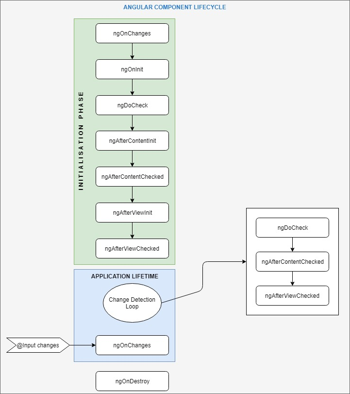

# Component

## Overview
A component is responsible for the rendering, it shouldn't handle business logic.  

It can be defined by up to 4 files:
* **myComponent.component.ts**  
    Core definition of the component.
* **myComponent.component.html**   
    HTML template of the graphical component.
* **myComponent.component.css**  
    CSS file specific to this component.
* **myComponent.component.spec.ts**  
    Unitary tests of the component.

### Component Structure

```Typescript
import { Component } from '@angular/core';

@Component({
    selector: 'my-comp',
    templateUrl: './myComp.component.html',
    styleUrls: ['./myComp.component.css'],
    providers: [],
    encapsulation: ViewEncapsulation.ShadowDom

})
export class MyComponent {
    constructor() {}
}
```
* **selector**  
    Define the way the component is called from parent template. There are 3 ways to define a selector which fit with different ways to call it:
    * 'my-comp' => \<my-comp>\</my-comp>
    * '[my-comp]' => \<div my-comp>\</div>
    * '.my-comp' => \<div class="my-comp">\</div>
* **template**  
    HTML file defining the rendering.
* **style**  
    SCSS/CSS file.
* **providers**  
    Service can be declared at component level, in this a new service service is instantiated at each component instantiation.
* **Encapsulation Mode**  
    There are 4 modes:
    * ShadowDom  
      Modern implementation.
    * Native  
      Deprecated
    * Emulated  
      Default
    * None   
      Disable encapsulation, the style is added to the global styles.

To be used in the module application, a component has to be defined in this module in declarations array.

----------------------

## Component Lifecycle
A component has a lifecycle managed by Angular. Angular creates it, renders it, creates and renders its children, checks it when its data-bound properties change, and destroys it before removing it from the DOM.  
As a component is a specific Directive, directives have the same lifecycle.  




To add behavior to a lifecyclehook, the component should implement the corresponding interface (even if it's optional as JS doesn't have interface and can't see interface at runtime).  

Before a view is displayed, Angular evaluates the directives and resolves the binding syntax in the template to modify the HTML elements and the DOM.  
Angular updates the display when these properties change. More precisely, the redisplay occurs after some kind of asynchronous event related to the view, such as a keystroke, a timer completion, or a response to an HTTP request.  
Angular updates the bindings (and therefore the screen) only if the app does something in response to asynchronous events.

### ngOnChanges
Called before ngOnInit() and whenever it detects changes to input properties of the component.  
Respond when Angular (re)sets data-bound  from @Input properties.  

```Typescript
export class myCompoennt implements OnChanges {
    ngOnChanges(changes: SimpleChanges) { 
        for (let propName in changes) {
            let chng = changes[propName];
            let cur  = JSON.stringify(chng.currentValue);
            let prev = JSON.stringify(chng.previousValue);
            this.changeLog.push(`${propName}: currentValue = ${cur}, previousValue = ${prev}`);
        }
    }
}
```

### ngOnInit
Initialize the component after Angular first displays the data-bound properties and sets the component's input properties.

```Typescript
export class myComponent implements OnInit {
    ngOnInit() { ... }
}
```
Generally, this hook is used for 2 types of task:
* Perform complex initializations shortly after construction  
    Data fetching from services has to be done in ngOnInit() method. Not in constructor.  
    Constructor is limited for simple initialization, no complex ones as call asynchroneous method like service.
* Set up the component after Angular sets the input properties (in OnChanges)  


### ngDoCheck
Called during every change detection run, immediately after ngOnChanges() and ngOnInit().  
Detect and act upon changes that Angular can't or won't detect on its own.  

### ngAfterContentInit
Called once after the first ngDoCheck().  
Respond after Angular projects external content into the component's view .  

### ngAfterContentChecked
Called after the ngAfterContentInit() and every subsequent ngDoCheck().
Respond after Angular checks the content projected into the component.

### ngAfterViewInit
Called once after the first ngAfterContentChecked().  
Respond after Angular initializes the component's views and child views.  

### ngAfterViewChecked
Called after the ngAfterViewInit() and every subsequent ngAfterContentChecked().  
Respond after Angular checks the component's views and child views .  

### ngOnDestroy
Called just before Angular destroys the directive/component.  
Cleanup just before Angular destroys the directive/component. Unsubscribe Observables and detach event handlers to avoid memory leaks.  

-----------------------
## HTML Template
### Basics Syntax
* **Template expression**  
    A template expression produces a value and is used in string interpolation and One-Way data-binding.  
    an template expression:
    * Must be idempotent (don't change the state of the application)
    * Should be quick as they are executed every change detection cycle
    * Simple, as it's easier to test in component

* **Template Statement**  
    Used for event binding. 

* **Template Reference Variable (#varName)**  
```
<input #phone placeholder="phone number" />

<button (click)="callPhone(phone.value)">Call</button>
```

* **$any**
```
<p>The item's undeclared best by date is: {{$any(item).bestByDate}}</p>
```

* **Operator** 
```
# Null-safe operator: call the property/method on the object only if non-null
<p>The item name is: {{item?.name}}</p>

# Non-null assertion operator: Indicates to compiler that the object is non-null (not ensure it)
<p *ngIf="item">The item's color is: {{item!.color}}</p>
```


### Data Binding
Data bindong target DOM properties not HTML attributes.  
HTML attributes are just there to initialize the DOM properties.

#### String interpolation  
```HTML
{{var}}
```

#### One-way data-binding model to view
```HTML
<input [property1]="TypescriptExpression">
<input bind-property1="TypescriptExpression">
```
Specific kind of binding:
```
<div [class.special]="isSpecial">Special</div>
<button [style.color]="isSpecial ? 'red' : 'green'">
```

#### Event binding
```HTML
<input (eventName)="myFunction($event)">
<input on-eventName="myFunction($event)">
<input #searchBox id="search-box" (input)="search(searchBox.value)" />
```

Event:
* click
* update
* blur
* keyup
* keyup.enter (specific key)


#### Two-way data-binding
```HTML
<!-- name attribute is mandatory inside a form block.-->
<tag [(property1)]="var" name="var"> 
<tag bindon-property1="var" name="var"> 
```

`[(property1)]="var"` notation is a shortcut for: 
```
[property1]="var"
(property1)="func($event)" // $event contains the value to be assigned to var
```

Most of the time, we’ll use the shortcut, however sometimes when we need to process the value before the assignment, we could use the “long” version. For instance, applying uppercase:
```
[property1]=”title”
<!-- $event contains the value to be assigned to title, the method will uppercase the value and will assign it to title. -->
(input)=”setUppercaseTitle($event)” 
```

### Style
The style sheet define at component level apply only within the template of this component (neither parent nor children component).  

You can import CSS inside CSS file: `@import mynested.css`.  


#### Special Selectors
* **:host**  
    Targets styles in the element that hosts the component 
    ```CSS
    :host {
        display: block;
        border: 1px solid black;
    }   
    
    :host(.active) {
        border-width: 3px;
    }
    ```


* **:host-context**  
    Allow to apply styles based on some condition outside of a component's view.  
    The :host-context() selector looks for a CSS class in any ancestor of the component host element, up to the document root.

    ```CSS
    # Apply style to h2 in the component, if some ancestor has the class "theme-light"
    :host-context(.theme-light) h2 {
        background-color: #eef;
    }
    ```


------------------


-------------------
## Parent-child component relationship
#### Pass parameter downward
In parent component's template:  
```
<child-component [propertyName]="value"></child-component>
```

In child component definition, the attribute is decorated with @Input:
```
import { Input } from '@angular/core';

export class ChildComponent {
    @Input() propertyName: Type;
    ...
}
```

#### Emit Event back
* In child component
```Typescript
import { Input, Output, EventEmitter } from '@angular/core';

export class ChildComponent {
    @Ouput() notify = new EventEmitter();
    @Input() product: Product;
    ...
}
```

```HTML
<p *ngIf="product.price > 700">
  <button (click)="notify.emit()">Notify Me</button>
</p>
```

* In parent component
```Typescript
import { Output, EventEmitter } from '@angular/core';

export class ChildComponent {

    onNotify() {
        window.alert('You will be notified when the product goes on sale');
    }
    ...
}
```

```HTML
<app-child
  [product]="product" 
  (notify)="onNotify()">
</app-child>
```

#### Manipulate Child from Parent
Allow parent to access properties/methods of its child 

* **Local variable way**  
    Only accessible from template

    ```HTML
    <!-- in .html -->
    <app-child #child1></app-child>
    <button (click)="child1.stop()">Stop</button>
    <div class="seconds">{{child1.myvalue}}</div>
    ```

* **ViewChild**  

```
 <app-child #child1></app-child>

---
export class CountdownViewChildParentComponent implements AfterViewInit {
 
  @ViewChild(AppChildComponent, {static: false})
  private appChild: AppChildComponent;
 
  start() { this.appChild.start(); }
```

## Dynamic Component

1. Create a directive
```TypeScript
@Directive({
  selector: '[dir-host]',
})
export class MyDirectiveDirective {
  constructor(public viewContainerRef: ViewContainerRef) { }
}
```

2. Setup the parent component
   * Add a directive ng-template referencing the new created directive
        ```HTML
        <div>
            <h3>Dynamic Component</h3>
            <ng-template dir-host></ng-template>
        </div>
        ```
   * Resolve component
```TypeScript
export class ParentComponent implements OnInit, {
  @Input() components: MyComponent[];
  @ViewChild(MyDirectiveDirective, {static: true}) dirHost: MyDirectiveDirective;

  constructor(private componentFactoryResolver: ComponentFactoryResolver) { }

  ngOnInit() {
    this.loadComponent();
  }

  loadComponent() {
    const comp = components[0]; 
    # Create an instance of the component
    const componentFactory = this.componentFactoryResolver.resolveComponentFactory(comp.component);

    # Retrieve ViewContainerRef of the directive
    const viewContainerRef = this.dirHost.viewContainerRef;
    viewContainerRef.clear();

    # Create reference to the loaded component and assign it
    const componentRef = viewContainerRef.createComponent(componentFactory);
    (<AdComponent>componentRef.instance).data = comp.data;
  }
}

export interface AdComponent {
  data: any;
}

```

__Warning__: To ensure that the compiler still generates a factory, add dynamically loaded components to the NgModule's entryComponents array.  
